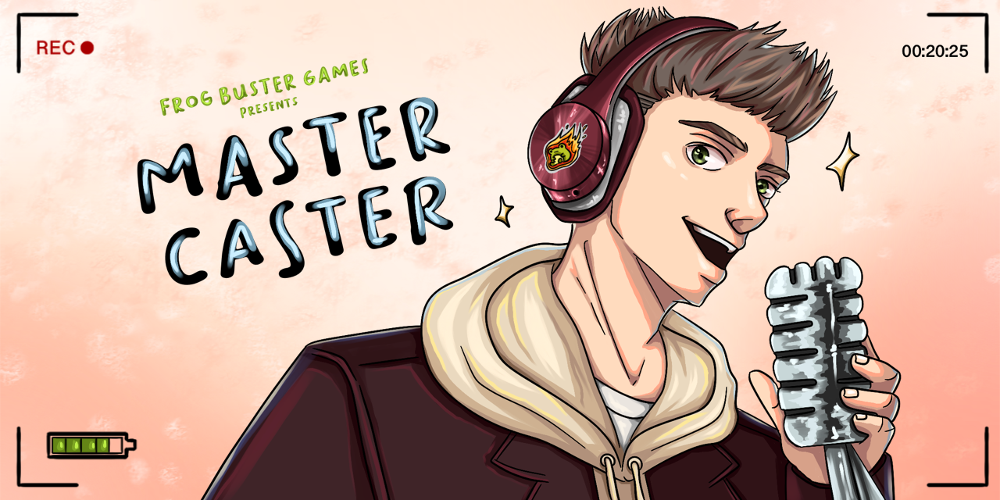
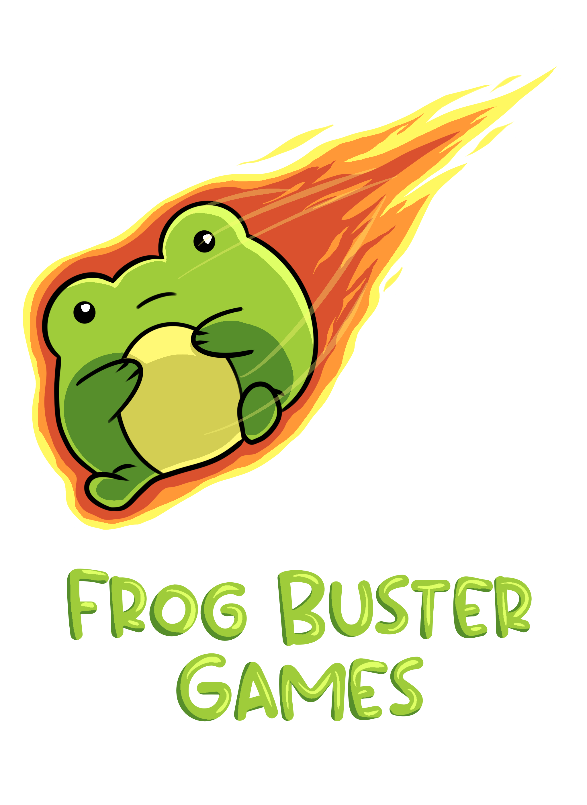

# MasterCaster

*A satirical single-player simulation-strategy game where you grow your own gaming podcast empire.*

 

## Description

In MasterCaster, you start broke, with a dusty mic and no listener - but your dream is clear: become the world’s most iconic gaming podcaster.  
Read hilarious in-game news, invite fictional gaming legends as guests, manage your show’s tone and sponsors, and - even more controversially - unlock the dark web to boost your reach with questionable methods.

Explore unique features like:
- Podcast creation with evolving quality
- News that feeds your content strategy
- Guest interaction with branching outcomes
- Sponsorship deals to make big bucks
- Dark web missions with high risk & reward

This game was developed as a university project using Unity 6000.0.44f1 and C#.

 

## Team

- **Unik Kelmendi** – Management, Programming
- **Damian Dalinger** – Programming
- **Philipp Birk** – Game Design
- **Simon Gremm** – Sound, Game Design
- **Lena Truong** – Art

  

## License

This project is licensed under the MIT License. See the [LICENSE](./LICENSE) file for more details.

**Note:** All visual and audio assets in this project are © 2025 by the contributing team members.  
They may be reused or redistributed for non-commercial purposes only, provided that proper credit is given to the original creators.
